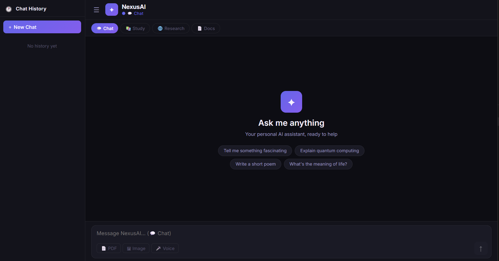
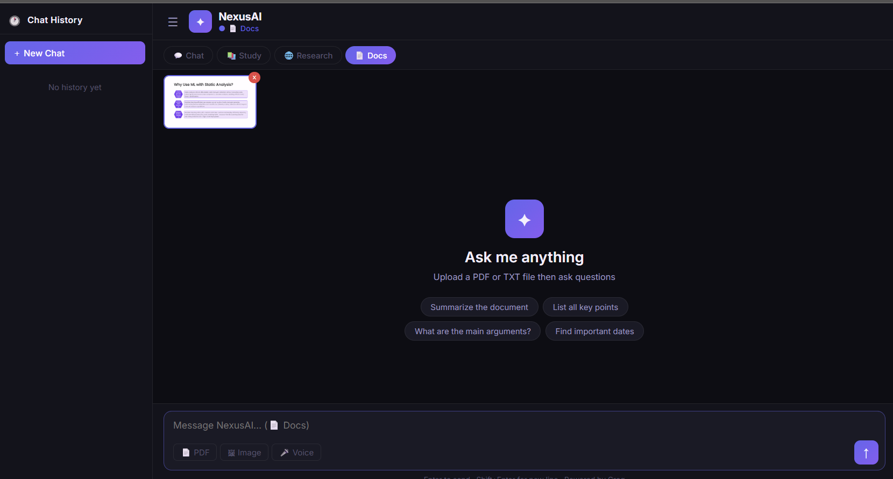

# NexusAI 🤖
### Full-Stack AI Chatbot (Python + React)

NexusAI is a powerful full-stack AI chatbot that supports multiple interaction modes including chat, research, document Q&A, and voice/image input.

---

## 🚀 Features

- 💬 Multi-mode chatbot:
  - Chat mode  
  - Study assistant  
  - Research mode  
  - Document Q&A  

- 📄 File handling:
  - Upload PDF/TXT files  
  - Ask questions from documents  

- 🧠 AI capabilities:
  - Context-aware responses  
  - Image input 
  - Voice input  

- 🖥️ Full-stack architecture:
  - FastAPI backend  
  - React + Vite frontend  

- 💾 Chat history stored in browser  

---

## 🛠️ Tech Stack

- **Frontend:** React.js
- **Backend:** FastAPI (Python)  
- **API:** Groq API (LLM)  
- **Other:** REST APIs  

---

## 📸 Demo

### 💬 Chat Interface

### 📄 File Upload

---
